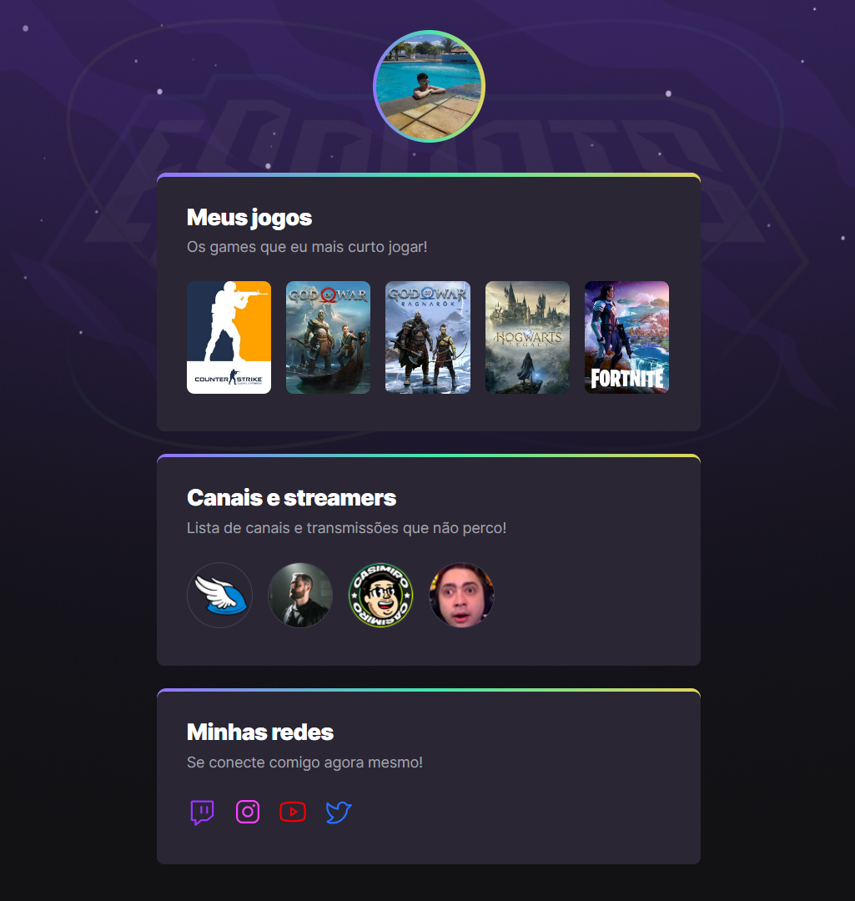

<h1 align="center" id="title">Game Hub</h1>

## Índice

- [Visão geral](#visão-geral)
  - [Screenshot](#screenshot)
  - [Links](#links)
- [Meu processo](#meu-processo)
  - [Tecnologias](#tecnologias)
  - [Recursos úteis](#recursos-úteis)
- [Redes Sociais](#redes-sociais)

## Visão geral
> Um site centralizador de links, no estilo Linktree, feito especialmente para gamers.

> Projeto construído no evento Next Level Week da Rocketseat.

### Screenshot

### Links
[🔗 Clique aqui para acessar](https://jordanferreiraa.github.io/game-hub)

## Meu processo

### Tecnologias
- [HTML](https://developer.mozilla.org/pt-BR/docs/Web/HTML)
- [CSS](https://developer.mozilla.org/pt-BR/docs/Web/CSS)

###  Recursos úteis
- [ Rocketseat ](https://www.rocketseat.com.br/)
- [ website w3schools ](https://www.w3schools.com/)

## Redes Sociais

- Linkedin - [ @jordan-ferreira-sousa ](https://www.linkedin.com/in/jordan-ferreira-sousa/)
- Instagram - [ @jordanferreirae ](https://www.instagram.com/jordanferreirae)

&#xa0;

<a href="#title">Back to top</a>